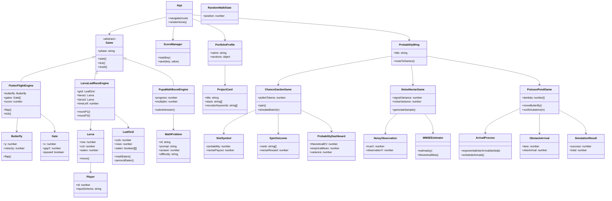

# UML Class Diagram — Scaly Wings

```mermaid
classDiagram
    class App {
        +navigate(route)
        +renderHome()
    }

    class Game {
        <<abstract>>
        +phase: string
        +start()
        +tick()
        +reset()
    }

    class FlutterFlightEngine {
        +butterfly: Butterfly
        +gates: Gate[]
        +score: number
        +flap()
        +tick()
    }

    class LarvaLeafRaceEngine {
        +grid: LeafGrid
        +larva1: Larva
        +larva2: Larva
        +timeLeft: number
        +moveP1()
        +moveP2()
    }

    class PupaMathBoostEngine {
        +progress: number
        +multiplier: number
        +submitAnswer()
    }

    class Player {
        +id: number
        +inputScheme: string
    }

    class Butterfly {
        +y: number
        +velocity: number
        +flap()
    }

    class Larva {
        +row: number
        +col: number
        +eaten: number
        +move()
    }

    class LeafGrid {
        +cols: number
        +rows: number
        +eaten: boolean[][]
        +markEaten()
        +percentEaten()
    }

    class Gate {
        +x: number
        +gapY: number
        +passed: boolean
    }

    class MathProblem {
        +id: string
        +prompt: string
        +answer: number
        +difficulty: string
    }

    class ScoreManager {
        +load(key)
        +save(key, value)
    }

    class PortfolioProfile {
        +name: string
        +sections: object
    }

    class ProjectCard {
        +title: string
        +stack: string[]
        +recruiterKeywords: string[]
    }

    App --> Game
    Game <|-- FlutterFlightEngine
    Game <|-- LarvaLeafRaceEngine
    Game <|-- PupaMathBoostEngine
    FlutterFlightEngine --> Butterfly
    FlutterFlightEngine --> Gate
    LarvaLeafRaceEngine --> Larva
    LarvaLeafRaceEngine --> LeafGrid
    Larva --> Player
    PupaMathBoostEngine --> MathProblem
    App --> ScoreManager
    App --> PortfolioProfile
    PortfolioProfile --> ProjectCard

    class ProbabilityWing {
        +title: string
        +routeToGames()
    }

    class ChanceGardenGame {
        +pollenTokens: number
        +spin()
        +simulateBatch(n)
    }

    class SlotSymbol {
        +probability: number
        +nectarPayout: number
    }

    class SpinOutcome {
        +reels: string[]
        +nectarReward: number
    }

    class ProbabilityDashboard {
        +theoreticalEV: number
        +empiricalMean: number
        +variance: number
    }

    class NoiseNectarGame {
        +signalVariance: number
        +noiseVariance: number
        +generateSample()
    }

    class RandomWalkState {
        +position: number
    }

    class NoisyObservation {
        +trueX: number
        +observationY: number
    }

    class MMSEEstimator {
        +estimate(y)
        +theoreticalMse()
    }

    class PoissonPondGame {
        +lambda: number[]
        +moveButterfly()
        +runSimulations(n)
    }

    class ArrivalProcess {
        +exponentialInterArrival(lambda)
        +scheduleArrivals()
    }

    class ObstacleArrival {
        +lane: number
        +interArrival: number
    }

    class SimulationResult {
        +success: number
        +total: number
    }

    App --> ProbabilityWing
    ProbabilityWing --> ChanceGardenGame
    ProbabilityWing --> NoiseNectarGame
    ProbabilityWing --> PoissonPondGame
    ChanceGardenGame --> SlotSymbol
    ChanceGardenGame --> SpinOutcome
    ChanceGardenGame --> ProbabilityDashboard
    NoiseNectarGame --> NoisyObservation
    NoiseNectarGame --> MMSEEstimator
    PoissonPondGame --> ArrivalProcess
    PoissonPondGame --> ObstacleArrival
    PoissonPondGame --> SimulationResult
```
