# UML Sequence Diagrams — Scaly Wings

## 1. Starting a game

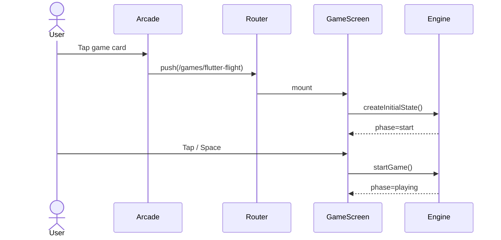

## 2. Flutter Flight game loop

```mermaid
sequenceDiagram
    participant Loop
    participant Engine
    participant Screen
    participant Storage

    loop Every frame
        Loop->>Engine: tick(state)
        Engine-->>Screen: new positions / score
    end
    User->>Screen: flap
    Screen->>Engine: flap(state)
    Engine-->>Screen: updated velocity
    Note over Engine: collision → gameover
    Screen->>Storage: saveScore(high)
```

## 3. Larva Leaf Race match

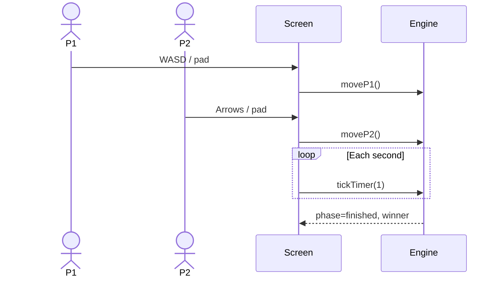

## 4. Pupa Math Boost correct answer

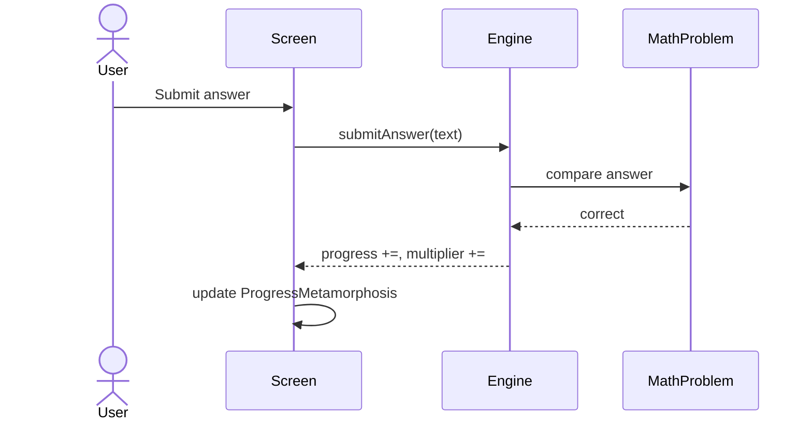

## 5. Saving and loading high score

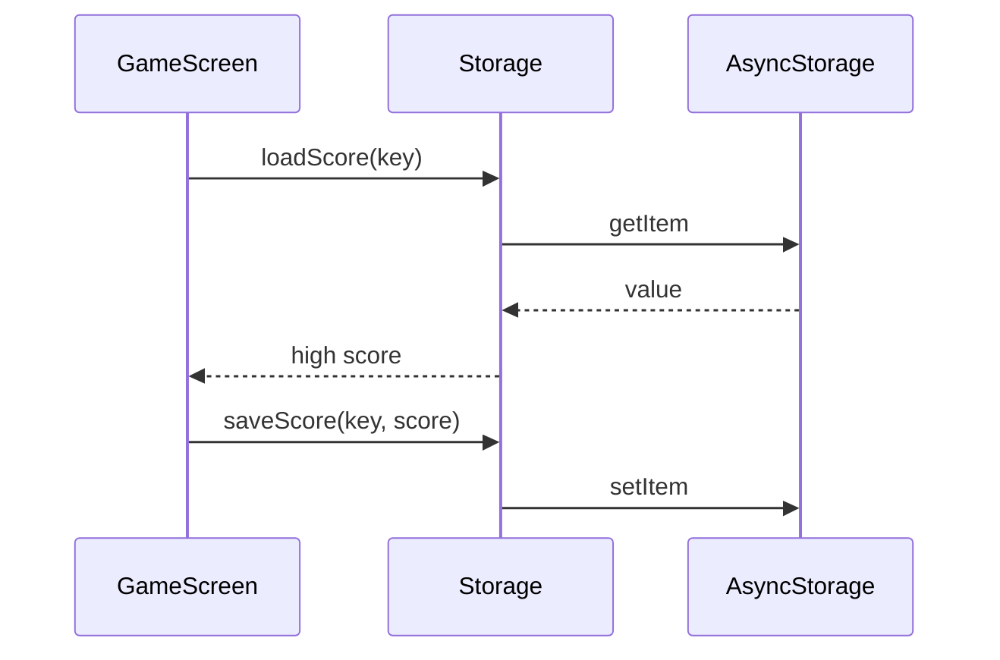

## 6. Recruiter viewing portfolio

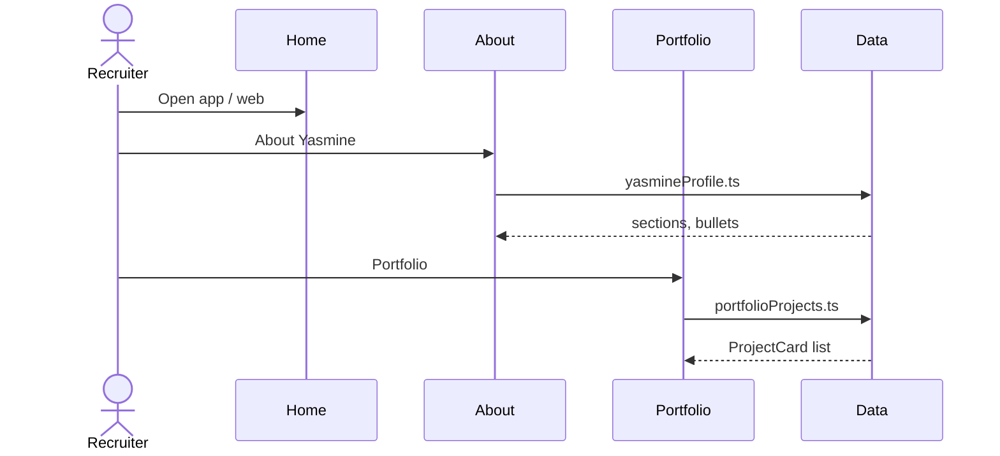

## 7. Player spins in Butterfly Chance Garden

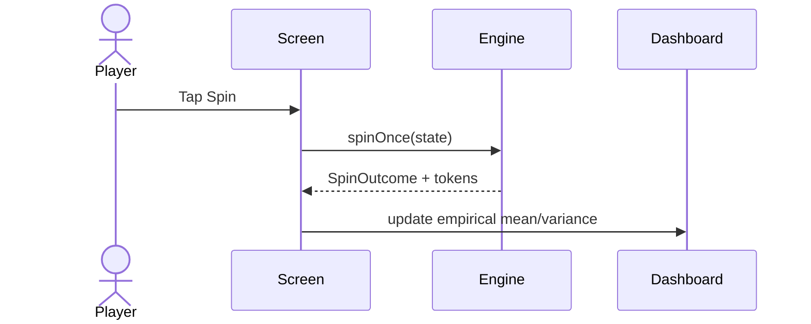

## 8. Chance Garden computes expected value

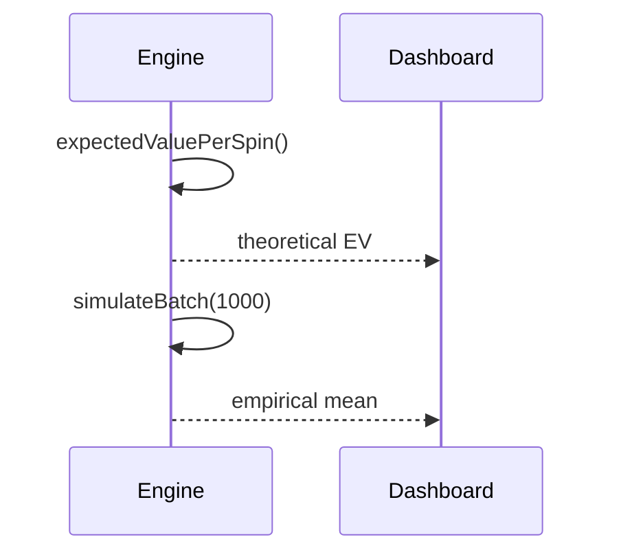

## 9. Noise Nectar generates true state and noisy observation

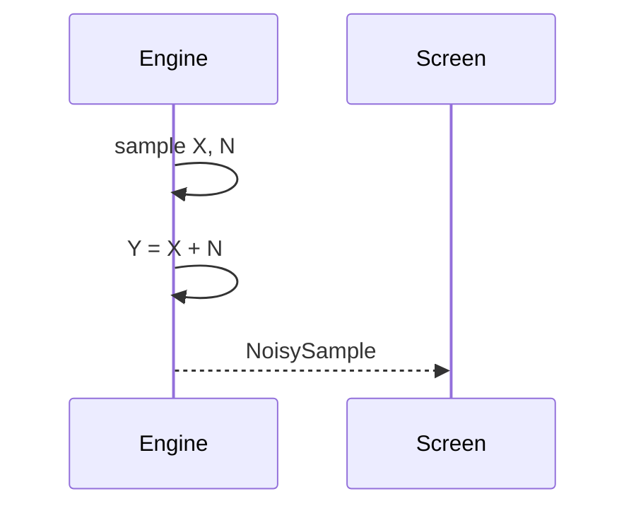

## 10. MMSE helper estimates hidden nectar

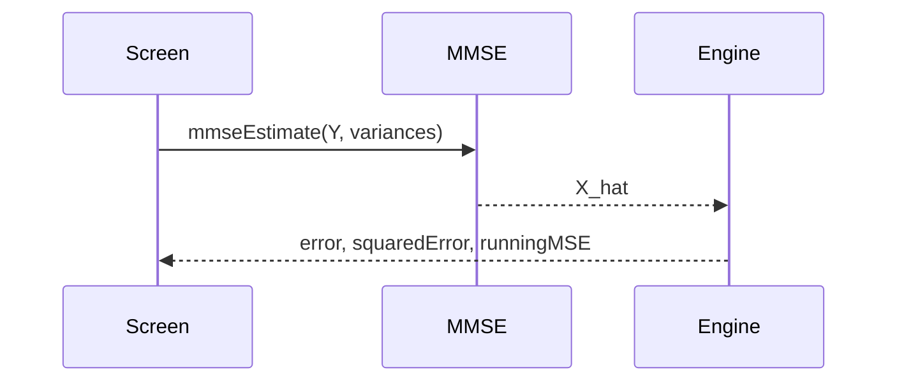

## 11. Poisson Pond schedules obstacle arrivals

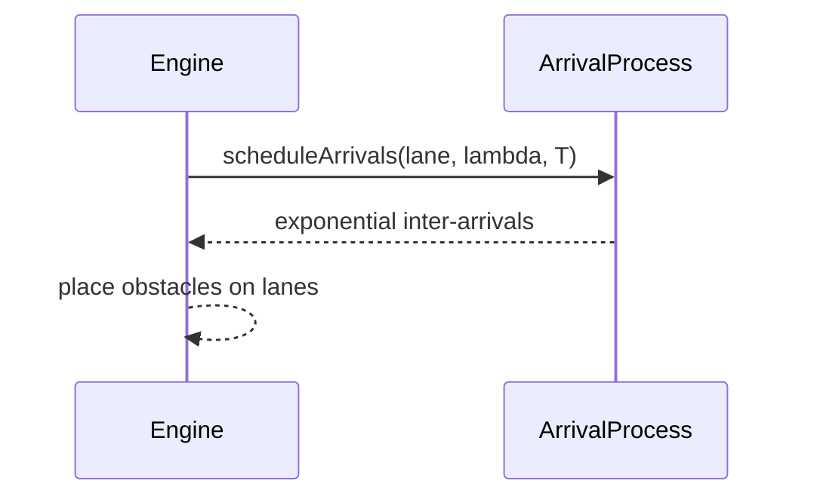

## 12. Simulation mode runs many crossings

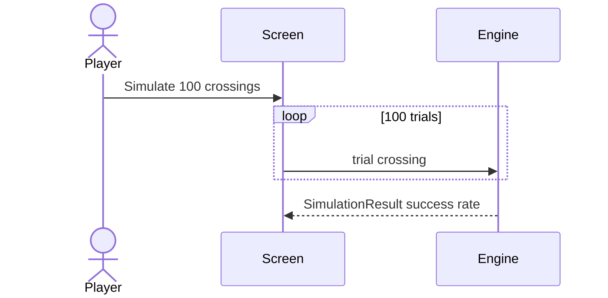
